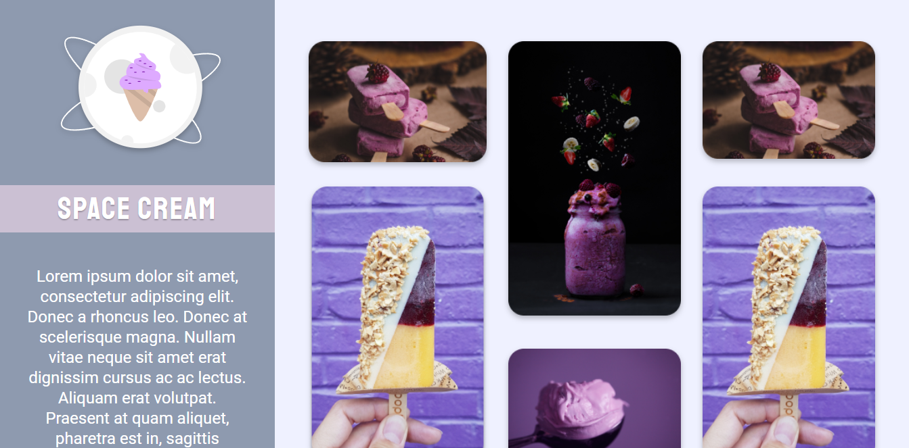

# Desafio Space Cream

> Trilha Explorer

Último desafio do stage 3 da trilha explorer da Rocketseat succssesfully finished. Feito 100% do zero através de um layout do figma, nele aprendi sobre mobile first, responsividade, grid layout, variáveis no css and so on \o/.

[🔗 Clique aqui para acessar](https://filipesantos07.github.io/Rocketseat-desafio-Space-Cream/)

## 🛠️ Tecnologias

- HTML
- CSS

## 💛 Contato

FilipeSantosEstudos1@gmail.com
